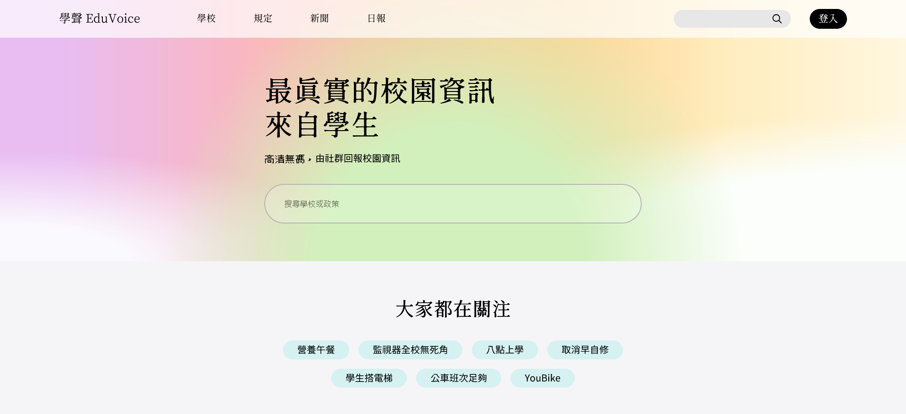
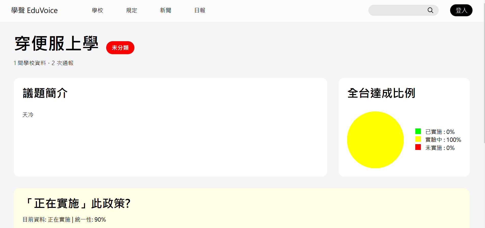

# 學聲 EduVoice

EduVoice is an innovative school information platform designed to enhance campus transparency and student engagement. This platform allows students to report and access real-time updates on school regulations, daily news, and special events, fostering more active civic participation and awareness.

The platform sends daily newsletters to Line, providing students with a snapshot of various useful information, from the latest campus news to details about nutritious lunches.

EduVoice is not just an information platform but a demonstration of community-driven engagement, ensuring that students' voices are genuinely heard and valued on campus. This platform was incubated during the 2024 SITCON Hackathon and was created by Elvis Mao and Each Chen, aiming to bring unprecedented transparency and interactivity to campus life.


<!-- 學聲 EduVoice 是一個創新的學校資訊平台，專為加強校園透明度和學生參與而設計。這個平台允許學生實時上報和瀏覽關於校園規定、日常新聞和特殊事件的最新資訊，從而鼓勵更積極的公民參與和意識提升。

每日發送電子報至 Line，為學生提供從最新校園新聞到營養午餐等各種實用信息的概覽。

學聲 EduVoice 不僅是一個信息平台，更是一個社群動力的展示，讓學生的聲音在校園中被真正聽見和重視。此平台於 2024 年 SITCON Hackathon 中孵化，由 Elvis Mao 與 Each Chen 共同創建，旨在為校園生活帶來前所未有的透明度和互動性。 -->

## How to use
> This project hasn't been officially shipped yet. Please stay tuned for updates if you're interested.
### index



### issue
Reply to roles within your school.


## deploy

```
$ git clone https://github.com/Edit-Mr/EduVoice.git
$ cd EduVoice
$ yarn
$ yarn dev
```
